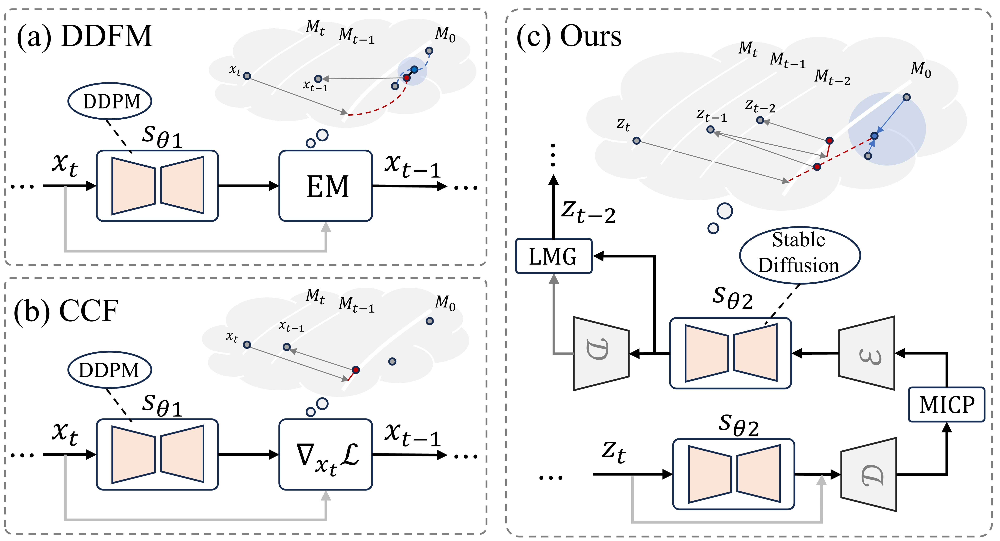

# [NeurIPS 2025] Projection-Manifold Regularized Latent Diffusion for Robust General Image Fusion

This repository is the official implementation of the **NeurIPS 2025** paper:
_"Projection-Manifold Regularized Latent Diffusion for Robust General Image Fusion"_.

### [Paper](https://proceedings.neurips.cc/paper_files/paper/2025/hash/7921c529626c3ef26cc3308c6b73f070-Abstract-Conference.html) | [Poster](https://neurips.cc/virtual/2025/loc/san-diego/poster/117987)



## 📢 News

- [x] **Code and demo data are released.**

## 🛠️ Installation

Clone this repository:

```bash
git clone https://github.com/Leiii-Cao/PDFuse.git
cd PDFuse
```

Create and activate the conda environment:

```bash
conda create -n PDFuse python=3.11.5
conda activate PDFuse
```

Install the required packages:

```bash
pip install -r requirements.txt
pip install --force-reinstall "huggingface-hub==0.23.3"
```

## 🚀 Inference
Please download the Stable Diffusion v1.5 model from Hugging Face:

- [Stable-Diffusion-v1-5](https://huggingface.co/stable-diffusion-v1-5/stable-diffusion-v1-5)
The default model path used by the code is:
```text
./pretrained/stable-diffusion-v1-5/
```

The repository includes several demo image pairs under `data/`.
```bash
bash test.sh
```
```bash
bash test_E.sh
```

## 📝 Citation

If our work assists your research, feel free to give us a star ⭐ or cite us using:

```bibtex
@article{cao2026projection,
  title={Projection-Manifold Regularized Latent Diffusion for Robust General Image Fusion},
  author={Cao, Lei and Zhang, Hao and Li, Chunyu and Ma, Jiayi},
  journal={Advances in Neural Information Processing Systems},
  volume={38},
  pages={83972--84003},
  year={2026}
}
```

## 📬 Contact

If you have any questions or discussions, please send me an email:

```text
whu.caolei@whu.edu.cn
```
